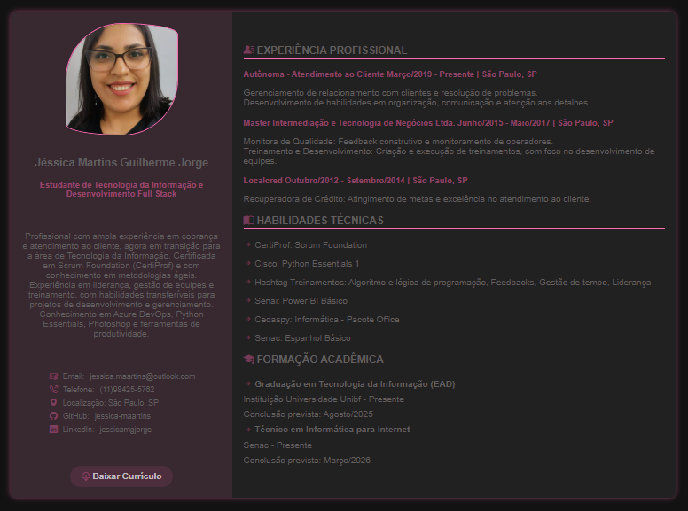

# Currículo em HTML e CSS

Este projeto é um currículo pessoal desenvolvido em HTML e CSS.  
Foi feito como parte do curso técnico em Informática para Internet, utilizando os conhecimentos iniciais de desenvolvimento web.

## 💼 O que tem neste projeto

- Estruturação semântica com HTML
- Estilização com CSS
- Layout dividido em colunas
- Imagem de perfil
- Cores e fontes personalizadas

## 📸 Preview

---

## 🚀 Veja o currículo funcionando:

👉 [Clique aqui para acessar via GitHub Pages](https://jessica-maartins.github.io/curriculo-html-css/)

---

## ✨ Tecnologias usadas

- HTML5  
- CSS3  
- Git e GitHub
